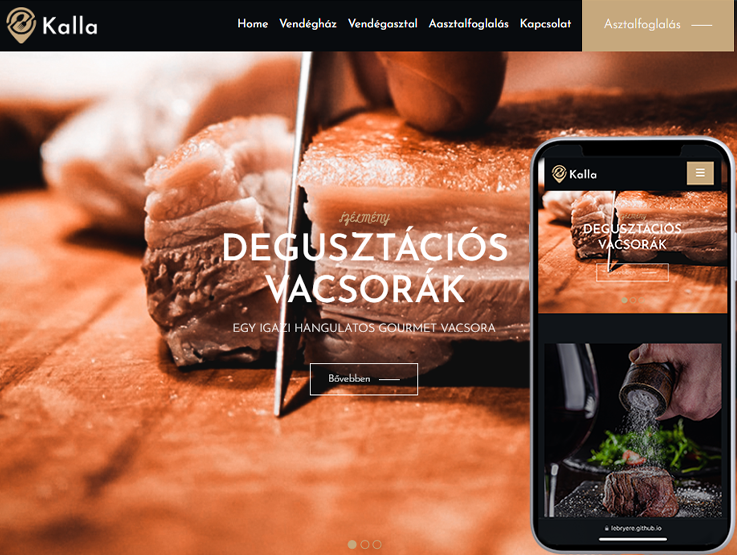

# [Kalla Vendégház](https://lebryere.github.io/Kalla/)

## Browser Support

 |  |  |  |  | 
--- | --- | --- | --- | --- | --- |
94+ ✔ | 92+ ✔ | 89+ ✔ | 82+ ✔ | 87+ ✔ | 55+ ✔ |

## Preview

[](https://lebryere.github.io/Kalla/)

**[View Live Preview](https://lebryere.github.io/Kalla/)**

## Status

[](https://raw.githubusercontent.com/LeBryere/Kalla/master/LICENSE).

## Usage

### Basic Usage

The inspiration for the site comes from the Kalla Guesthouse.
Kálmán Kalla, a master chef, went to Jena in the fall of 1966 to work as an intern in a hotel restaurant. Upon returning, he worked in the restaurant of the Royal Hotel and in restaurants around Lake Balaton. In 1968, he became the deputy head chef at the Margitszigeti Grand Hotel. In 1969, he worked at the Hotel Intercontinental, first as the deputy head chef at the Rendezvous restaurant, then as the manager of the Csárda restaurant, and finally as the head chef of the Bellevue restaurant. In 1973-74, he was the head chef at the Paprika Inn in Roppongi, Tokyo. From 1980, he worked at the Forum Hotel, and from 1990, he was the head chef at the Hungarian Embassy in Washington. From 1992, he was the kitchen director at Gundel Restaurant. He retired in 2006, and since then, in Sümegprága, he has been indulging in his lifelong passion for cooking at the Kalla Guesthouse.

### Variables
```css
	--primary-color: #c6a87d;
	--secondary-color: #101418;
	--dark-color: #080b0e;
	--grey-color: #777777;
	--white-color: #ffffff;
	--text-color: #ffffffcc;
	--custom-bg-color: #13181c;
	--body-fonts: 'Josefin Sans', sans-serif;
	--title-fonts: 'Josefin Sans', sans-serif;
	--sub-title-fonts: 'Miniver', cursive;
```

## Copyright and License

Copyright 2024 Lebryere. Code released under the [](https://raw.githubusercontent.com/LeBryere/Kalla/master/LICENSE).
